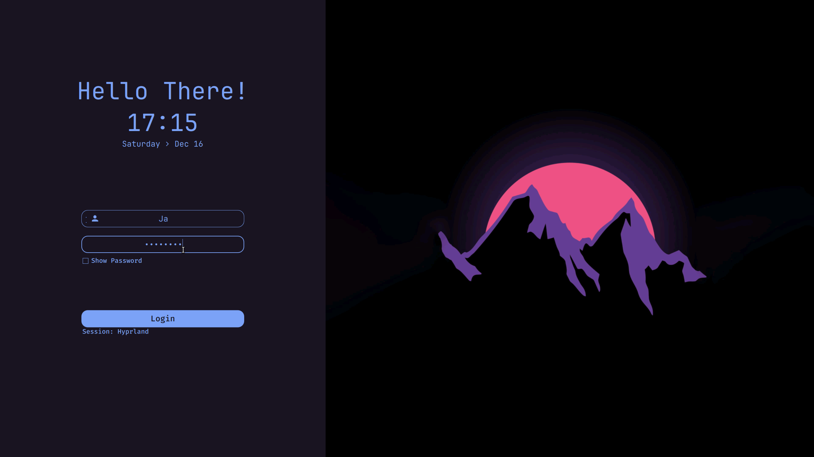
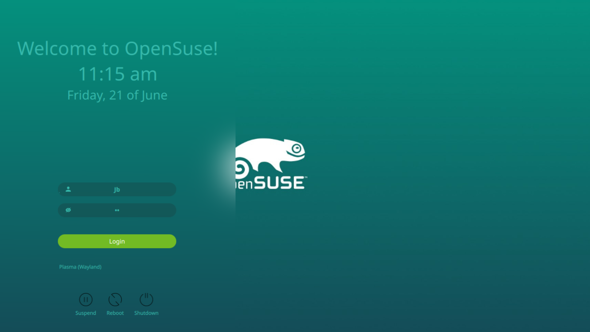

<h2 align="center">🗼 Simple SDDM Theme - QT5 🗼</h2>

<h1 align="center"> This will be the SDDM theme to be installed on some of my Hyprland Distro Install Scripts</h1>

for a QT6, please see [`HERE](https://github.com/JaKooLit/simple-sddm-2)

<p align=center>
A Simple theme variant for the <a href="https://github.com/sddm/sddm">SDDM Login Manager</a>
</p>

<h2 align=center>Preview</h2>
<center>

<details>
<summary align=center>More Previews</summary>



</details>

<details>
<summary align=center>More Previews <br> for Arch, Fedora and OpenSuse</summary>



</details>
</center>

## Install
### From sources
> _Assumes that you've installed and configured SDDM correctly_ (if not [read more](https://wiki.archlinux.org/title/SDDM))

>  Please make sure you have the following dependencies installed:
>  `qt5-quickcontrols2`, `qt5-graphicaleffects`, `qt5-svg` 

1. Open terminal, and clone the repository with:

   ```bash
   git clone https://github.com/JaKooLit/simple-sddm.git ~/simple-sddm
   ```

2. Then move it as follows:

   ```bash
   sudo mv ~/simple-sddm /usr/share/sddm/themes/
   ```

## Configure

Edit the '/etc/sddm.conf.d/theme.conf.user' (with any text editor with **raised** privileges), so that it looks like this:

```bash
sudo nano /etc/sddm.conf.d/theme.conf.user # use any text editor with raised privileges
---

[Theme]
Current=sddm
   ```

### Language and time format
- By default, it is configured with 24H format. You can change to AM/PM variant by editing the theme.conf
```bash
sudo nano /usr/share/sddm/themes/sddm/theme.conf  # use any text editor with raised privileges
```
- `HourFormat="hh:mm AP` . Make sure to disable the above of this part
- To change the default wallpaper put desired image in the `sddm/Backgrounds/` folder and add the name of the image followed by its extension (`.jpg` or `.png`) in `theme.conf` file.
- You can also customize it further if you wish in the `theme.conf`
(blur, form position, etc).


### Some extra themes
I have added 3 more themes for Arch, Fedora and OpenSuse-Tumbleweed so that anyone can use those for their distros. <br>
- Just copy one or those themes to your '/usr/share/sddm/themes' directory. For example:
```bash
sudo cp -r sddm/arch-sddm /usr/share/sddm/themes
```
- And now edit the '`/etc/sddm.conf.d/theme.conf.user`' file and change to:
```bash
[Theme]
Current=arch-sddm
```


## Credits
- Modified Theme which is based to this [`LINK`](https://github.com/rototrash/tokyo-night-sddm) by [**rototrash**](https://github.com/rototrash)


